# CCNA - 6. 使用交換器建置乙太區域網路

[TOC]

## 名詞定義

|   中文   | 英文簡稱 | 英文全稱|
| :--------: | :--------:| :------: |
|碰撞領域|CD||
|內容定址記憶體or交換表|CAM|Content Addressable Memory|
|泛洪||Flooding|
|擴展樹協定|STP||
|雙工不符||Duplex Mismatch|

## Hub、橋接器、Switch

### Hub

- **Hub**會產生**碰撞**問題。

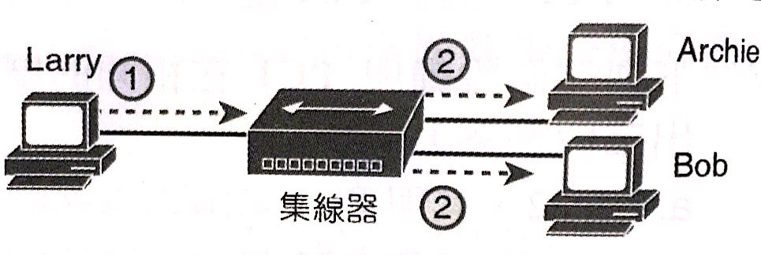

- **Hub**造成的**半雙工+CSMA/CD**的**防碰撞**原理，造成**頻寬共用**，且越多設備加入，**碰撞機率**越高。

### 橋接器

- **橋接器**將網路切割成**碰撞領域(CD)**。

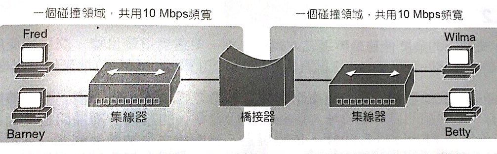

- **橋接器**將訊框留在一個Buffer中，直到確定目標CD空閒才送出。
- **橋接器**將每個CD切割，使每個CD有自己的全部頻寬。

### Switch

- **Switch**將每條線路視為單一CD。

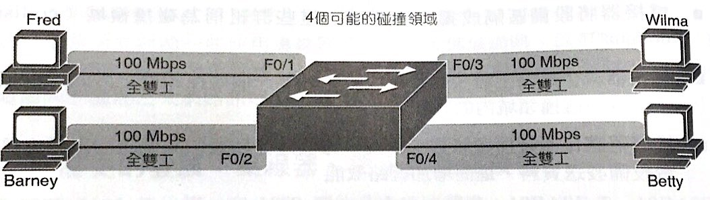

- **Switch**支援速度協商，也就是不同乙太網路速度皆可透過Switch溝通(Hub無法)。

- **Switch**收到訊框後，做以下三動作：

1. - 根據目的MAC位置，如果是廣播、群播or未知目的的單點傳播，則**泛洪(flooding)**出去。

- 若目的MAC位置與來源介面不同，則**轉送**，否則**過濾**掉(不轉送)

2. 根據來源MAC位置，紀錄到自己的交換表中，並將**閒置計時器**設為0。
3. 為了避免泛洪造成的第2層迴圈，所有Switch一同利用**擴展樹協定(STP)**，決定每個介面是否**封鎖**or**轉送**。

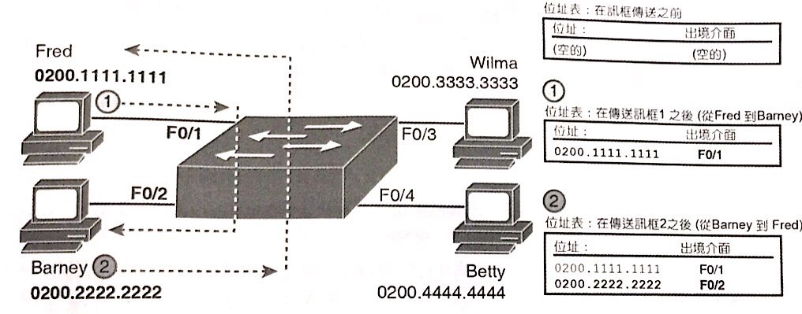

>**泛洪**：除了來源地以外，其他全部送一份訊框。同broadcast的意思。
>**閒置計時器**：表中每一個項目都有一個count，起始值是0。
>
>- 隨時間增加，計算這位客人多久沒有來消費了。
>- 當表格滿出來的時候，將最久沒來的項目刪除。

>**封鎖**：指介面不能轉送或收到訊框。適當封鎖介面可以使LAN區段僅存一條有效路徑。

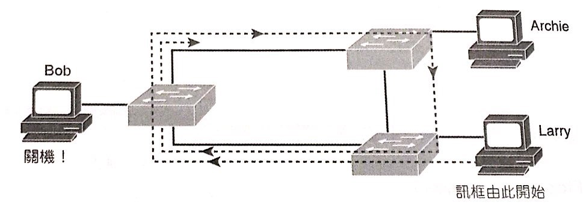

- Switch內部有三種轉送的方式。由於現在鏈路速度夠快，因此採用第一種居多。

## 乙太區網設計選擇

### 碰撞領域

- **網路介面卡(NIC)**的集合。
- 其中一個NIC發送的訊框會與相同碰撞領域內的任一個其他NIC訊框發生碰撞。

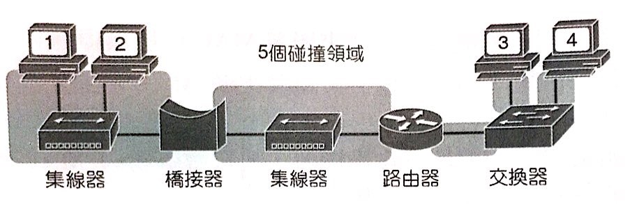

- 設備**共用頻寬**。
- **Hub**造成100Mbps的鏈路，同一時間只有一台PC可以傳輸資料，因此LAN最大頻寬共100Mbps。
- **Switch**使每一條線路自成一個碰撞領域，加上全雙工，使整體LAN的頻寬拉至100＊PC數量＊2 Mbps。

### 廣播領域

- **網路介面卡(NIC)**的集合。
- 相同廣播領域內的其他NIC會收到一個NIC所發送的廣播訊框。
- 路由器不負則轉送乙太廣播訊框(忽略)，因此只有路由器會切割LAN的廣播領域。
- **交換器**與**橋接器**都會**泛洪廣播訊框**。

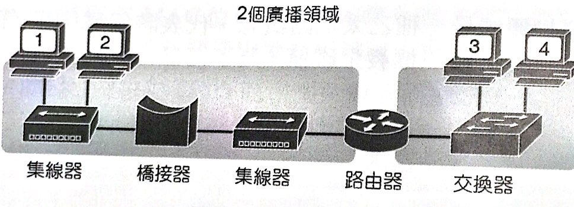

- 任一台廣播，會造成其他n-1台必須中斷CPU來處理廣播訊框。
- 因此，廣播領域不宜過大(n)。
- 何時使用**hub** & **switch**建置乙太網路是容易的。
- 何時使用**router**切割乙太網路的**廣播領域**是不容易的。

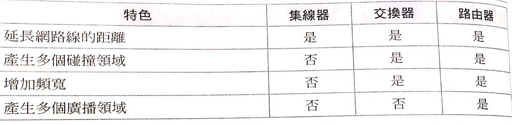

### VLAN

- **LAN**：由相同廣播領域內的設備所組成的。

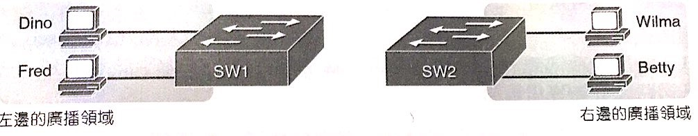

- 設定交換器，將不同介面的LAN，切割成不同的廣播領域(VLAN)。

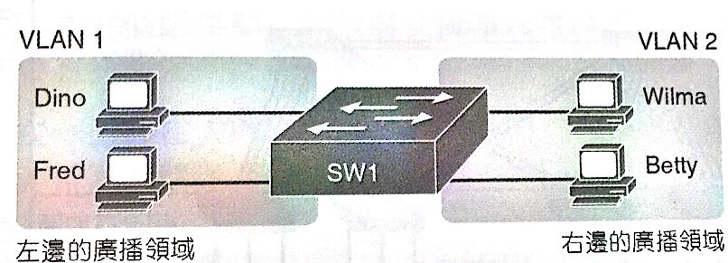

### 園區網路

- **存取層**：直接存取host端，正常任兩台存取層Switch不互相轉送。
- **分送層**：轉送存取層的訊框，每個存取層Switch至少使用1條**上行鏈路(uplink)**接到分送層。
- **核心層**：大型園區網路用，提供非常高轉送速度，轉送分送層訊框。

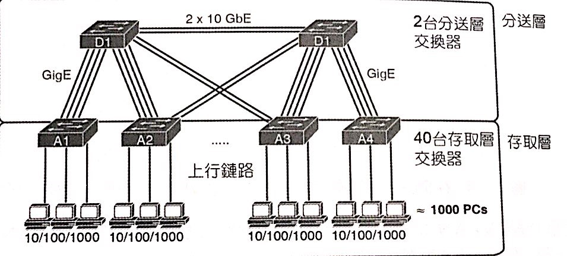

- UTP支援100公尺，而**雷射**(數千公尺)或LED的光纖更遠。
- 光纖纜線的類型有分，便宜但短的**多模**&昂貴較遠的**單模**。

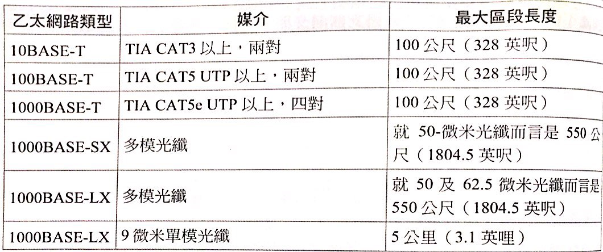

### 自動協商

- 原本，鏈路兩端必須使用相同標準。
- 因此萬一新設備，不吃舊線路，則必須更新很多(Switch & Switch連接到的host)。
- 因此，IEEE 802.3u定義了**自動協商**，要求每個節點告知自己吃的**協定清單**。
- 每個節點選出**最快速**且**最佳的雙工**設定。
- 可以關閉自動協商，但最好兩端一起關或一起開。
- 一邊關，一邊開，則**Cisco交換器**會**感應速度**，且根據**IEEE的預設值**，速度**10** or **100**則**半雙工**，否則**全雙工**。

>一般交換器會採用最慢速度(10Mbps)。

- 下圖F0/1顯示最壞結果：**雙工不符(duplex mismatch)**。

>PC1使用全雙工，但F0/1使用CSMA/CD+半雙工，收到訊框判定有機會**碰撞**，但實際上沒有，於是等待一段時間，重新傳送訊框。
>
>鏈路有在運作，但效能不彰。

- **Hub**不懂協商，所以採用IEEE的預設值(**10Mbps**&**半雙工**)。

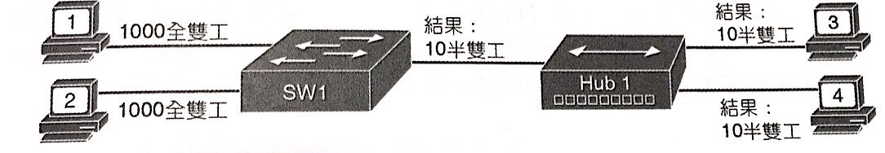
