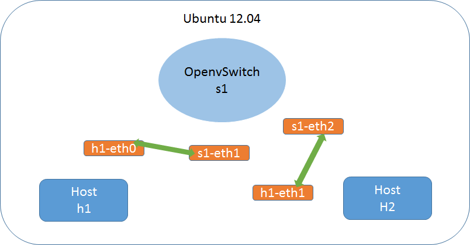

# Link

[toc]

- 接下來會根據拓墣的**Link**情況，去創建對應的**Interface**

- 首先，這邊使用到`Link`這個物件來表示每一條**Link**

- 每個**Link**實際上對應到的是兩個`Node`上面的**Interface**

`link.py`

``` Python
class Link( object ):

    """A basic link is just a veth pair.
       Other types of links could be tunnels, link emulators, etc.."""

    # pylint: disable=too-many-branches
    def __init__( self, node1, node2, port1=None, port2=None,
                  intfName1=None, intfName2=None, addr1=None, addr2=None,
                  intf=Intf, cls1=None, cls2=None, params1=None,
                  params2=None, fast=True ):
        """Create veth link to another node, making two new interfaces.
           node1: first node
           node2: second node
           port1: node1 port number (optional)
           port2: node2 port number (optional)
           intf: default interface class/constructor
           cls1, cls2: optional interface-specific constructors
           intfName1: node1 interface name (optional)
           intfName2: node2  interface name (optional)
           params1: parameters for interface 1
           params2: parameters for interface 2"""
        # This is a bit awkward; it seems that having everything in
        # params is more orthogonal, but being able to specify
        # in-line arguments is more convenient! So we support both.
        if params1 is None:
            params1 = {}
        if params2 is None:
            params2 = {}
        # Allow passing in params1=params2
        if params2 is params1:
            params2 = dict( params1 )
        if port1 is not None:
            params1[ 'port' ] = port1
        if port2 is not None:
            params2[ 'port' ] = port2
        if 'port' not in params1:
            params1[ 'port' ] = node1.newPort()
        if 'port' not in params2:
            params2[ 'port' ] = node2.newPort()
        if not intfName1:
            intfName1 = self.intfName( node1, params1[ 'port' ] )
        if not intfName2:
            intfName2 = self.intfName( node2, params2[ 'port' ] )

        self.fast = fast
        if fast:
            params1.setdefault( 'moveIntfFn', self._ignore )
            params2.setdefault( 'moveIntfFn', self._ignore )
            self.makeIntfPair( intfName1, intfName2, addr1, addr2,
                               node1, node2, deleteIntfs=False )
```

- 這邊要觀察到的，`Link`物件會呼叫`makeIntfPair`此方法，此方法就可以將兩個**Interface**給串接起來

`util.py`

``` python
def makeIntfPair( intf1, intf2, addr1=None, addr2=None, node1=None, node2=None,
                  deleteIntfs=True, runCmd=None ):
    """Make a veth pair connnecting new interfaces intf1 and intf2
       intf1: name for interface 1
       intf2: name for interface 2
       addr1: MAC address for interface 1 (optional)
       addr2: MAC address for interface 2 (optional)
       node1: home node for interface 1 (optional)
       node2: home node for interface 2 (optional)
       deleteIntfs: delete intfs before creating them
       runCmd: function to run shell commands (quietRun)
       raises Exception on failure"""
    if not runCmd:
        runCmd = quietRun if not node1 else node1.cmd
        runCmd2 = quietRun if not node2 else node2.cmd
    if deleteIntfs:
        # Delete any old interfaces with the same names
        runCmd( 'ip link del ' + intf1 )
        runCmd2( 'ip link del ' + intf2 )
    # Create new pair
    netns = 1 if not node2 else node2.pid
    if addr1 is None and addr2 is None:
        cmdOutput = runCmd( 'ip link add name %s '
                            'type veth peer name %s '
                            'netns %s' % ( intf1, intf2, netns ) )
    else:
        cmdOutput = runCmd( 'ip link add name %s '
                            'address %s '
                            'type veth peer name %s '
                            'address %s '
                            'netns %s' %
                            (  intf1, addr1, intf2, addr2, netns ) )
    if cmdOutput:
        raise Exception( "Error creating interface pair (%s,%s): %s " %
                         ( intf1, intf2, cmdOutput ) )

```

- 這邊可以看到，**mininet**實際上是透過系統中的`ip link`的方法，將兩個**interface**創造一條**veth的Link**

- 此時，我們的系統如下


