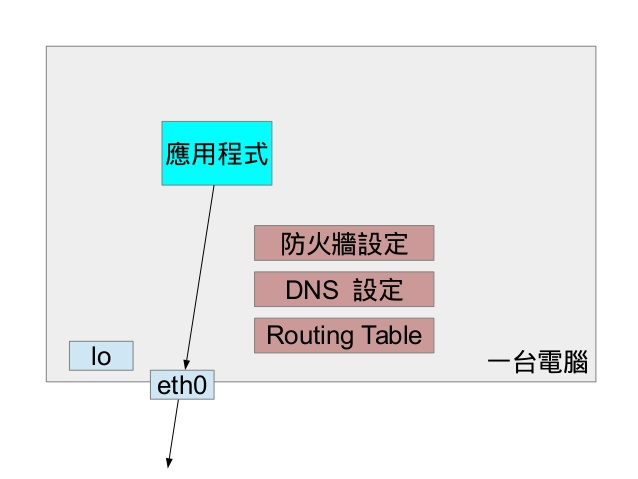
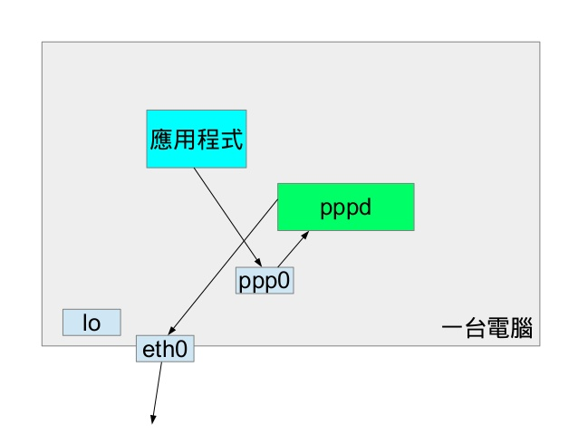
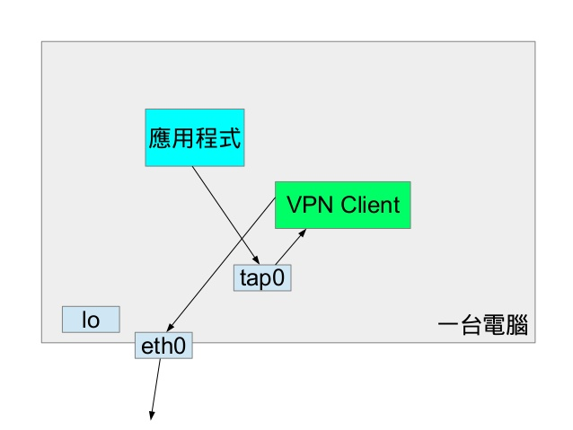
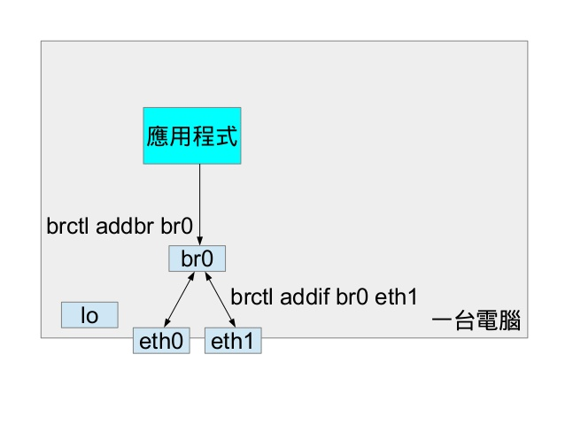
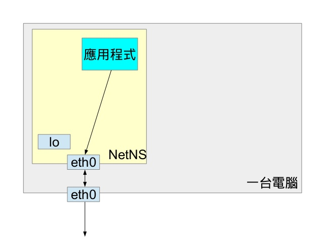
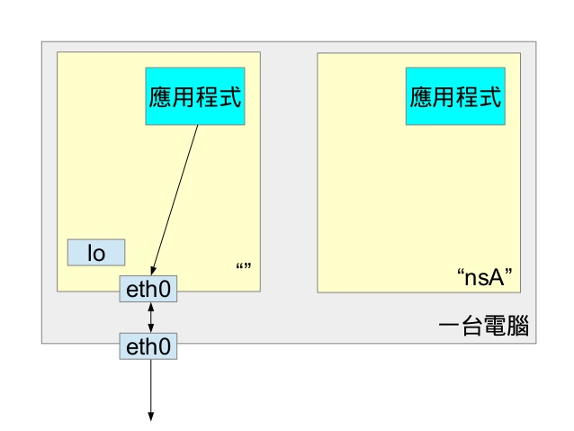
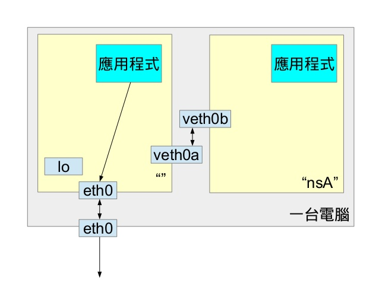
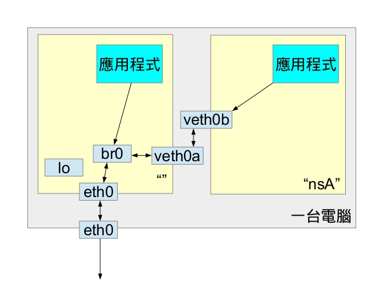

# 什麼是Network Namespace

[toc]

## 什麼是Network namespace

1. **虛擬化網路**相關的功能
2. **Linux**近幾年特有的技術(Darwin/Windows無類似功能)(約**Kernel 3.0**開始才有)
3. 是**輕量級**虛擬化技術的基礎（`Docker`,`LXC`,`OpenVZ`的原理）
4. 多用在**虛擬化**和**隔離**
5. 很少被單獨使用

## 虛擬化網路相關的功能,是指哪些？

- 不同**Network namespace**內的Process,具有不同的Network資源
如下：
  - `虛擬網卡列表`
  - `IPv4和IPv6協議`
  - `Routing Table`
  - `防火牆設定`
  - `/proc/net目錄`
  - `/sys/class/net目錄`
  - `埠（socket）`

## 有什麼特性？

- 簡單說就是幾個**Process**之間**搞小團體**，小團體有私有網路資源，且小團體之間互不干擾

- 多用在**虛擬化**和**隔離**

## 如果Network Namespace之間要互相溝通怎麼辦?

- 在不同的**Network namespace**間創建通道：`veth pair（虛擬網路設備對接口）`

- 不同**Network Namespace**因為**veth pair**得以`共享同一個實體網路設備`

## 傳統沒有Network natags: Namespace,Network namespacemespace前是怎樣？

- 一般**乙太網路**應用程式

- 如果是**ADSL**/光世代的**PPPoE**

- 如果是**VPN**

- 網卡拿來當Hub用的**Bridge**

>Bridge相關指令:
>
> - 需要安裝`bridge-utils`才能使用brctl
> - `brctl show` - 顯示bridge狀況
> - `brctl addbr/delbr` - 新增/刪除bridge
> - `brctl addif` - 將interface新增至bridge
> - `brctl delif` - 將interface從bridge移除

## 有Network namespace後是怎樣？

- 只有一個**Network namespace**的話

- 複數**Network namespace**的話

- 透過**veth**可以連接兩個**Network namespace**

- 搭配Bridge使其他**Network namespace**上網

## 有什麼應用場景？

1. 多個**Network namespace**可以`共享eth0和lo等實體網路設備`
2. 多個**Apache伺服器Process**可以在不同**Network namespace**的80埠上進行監聽
3. 一個**Process**不能嗅探其他**Network namespace**的流量
4. 一個**Process**不能關閉其他**Network namespace**的接口
