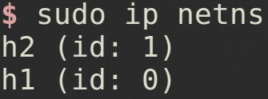
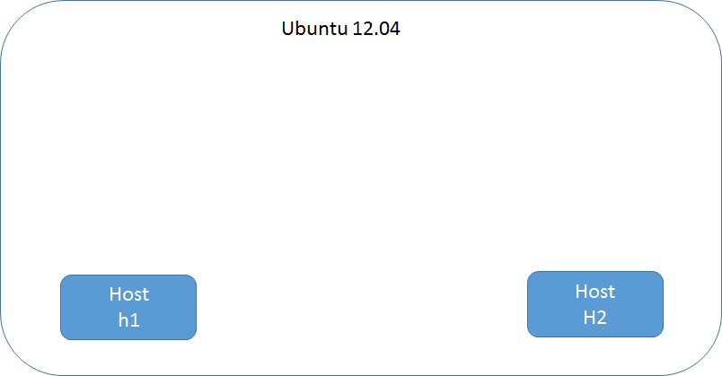
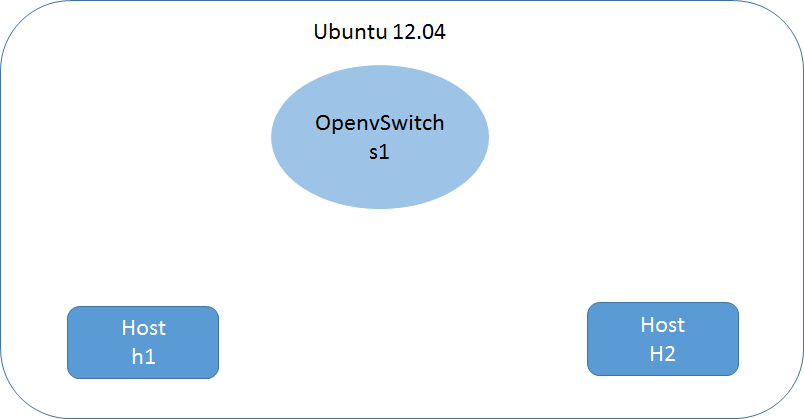
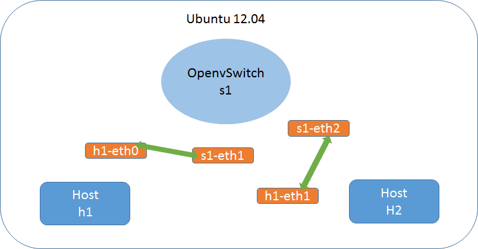
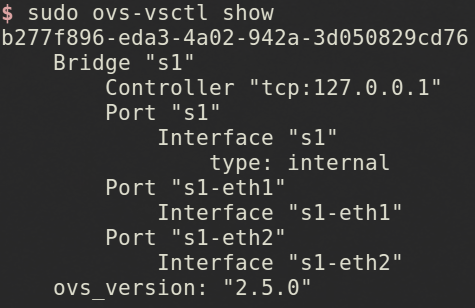

# 範例

[toc]

## 此範例的目標是？

- 使用`ip`創建**H1**和**H2**兩個`Network namespace`
  - **H1**擁有自己的**Network namespace**以及私有網路網路接口`h1-eth0`
  - **H2**擁有自己的**Network namespace**以及私有網路網路接口`h2-eth0`

- 使用`ovs-vsctl`創建**Software Switch S1**
  - **S1**有兩個埠`s1-eth0`和`s1-eth1`
  - **S1**運行在`root namespace`,並使用實體接口`eth0`，等待**Controller**的指令
  - 使用`veth pair`與對應的**Host**接口相連，這樣**H1**和**H2**就可以透過**S1**溝通
  - `s1-eth0`和`s1-eth1`間的通訊資料透過**Software Switch**轉發

## 什麼是ip command?

- `ip`這個command是`iproute2`軟體包裡面的一個強大的**網路配置工具**
  - 它能夠替代一些傳統的網路管理工具，例如:`ifconfig`、`route`
  - 使用權限要為`root`
  - 幾乎所有的**Linux**發行版本都支持該command

## 介紹ip command吧

- `ip netns add <NetNS 名稱>` - 新增**NetNS**
- `ip netns list` - 列出現有的**NetNS**
- `ip netns identify <PID>` - 顯示PID所在的**NetNS**
- `ip netns identify $$` - 顯示目前的**NetNS**
- `ip netns exec <NetNS 名稱> <command>` - 在**Network namespace**執行command
- `ip link add <veth 名稱> type veth peer name <veth 另一端的名稱>` - 建立一個**veth**裝置
- `ip link set <veth 名稱> nets <NetNS 名稱>` - 將**veth**搬到**NetNS**

## Step 1 - Create host namespaces

1. 建立**H1 namespaces**

- `sudo ip netns add h1`

2. 建立**H2 namespaces**

- `sudo ip netns add h2`

3. 察看建立結果

- `sudo ip netns`

## Step 2 - Create switch

1. 建立**Switch**

- `sudo ovs-vsctl add-br s1`

## Step 3 - Create links

1. 建立**Link 1(h1-eth0 - s1-eth1)**

- `sudo ip link add h1-eth0 type veth peer name s1-eth1`

2. 建立**Link 2(h2-eth0 - s1-eth2)**

- `sudo ip link add h2-eth0 type veth peer name s1-eth2`

3. 顯示連結結果

- `sudo ip link show`

## Step 4 - Move host ports into namespaces

1. 將**H1 port**移到**H1 namespaces**

- `sudo ip link set h1-eth0 netns h1`

2. 將**H2 port**接到**H2 namespaces**

- `sudo ip link set h2-eth0 netns h2`

3. 顯示**H1 namespaces**的連結

- `sudo ip netns exec h1 ip link show`

4. 顯示**H2 namespaces**的連結

- `sudo ip netns exec h2 ip link show`

## Step 5 - Connect switch ports to OVS

1. 將**S1 port1**連接到**Switch**

- `sudo ovs-vsctl add-port s1 s1-eth1`

2. 將**S1 port2**連接到**Switch**

- `sudo ovs-vsctl add-port s1 s1-eth2`

3. 顯示**Switch**的連結

- `sudo ovs-vsctl show`

## Step 6 - Set up OpenFlow controller

1. 設定**Controller**

- `sudo ovs-vsctl set-controller s1 tcp:127.0.0.1`

2. 設定**Controller**監聽端口**OpenFlow TCP**（默認值:`6633`)

- `sudo ovs-controller ptcp:`

3. 查詢**OpenFlow Controller**是否正確連接到**S1**

- `sudo ovs-vsctl show`

## Step 7 - Configure network

1. 修改**H1 port**網路介面，給予**H1 eth0**一個 `10.0.0.1` 的參數

- `sudo ip netns exec h1 ifconfig h1-eth0 10.1`

2. 啟動**H1 eth0**網路介面

- `sudo ip netns exec h1 ifconfig lo up`

3. 修改**H2 port**網路介面，給予**H2 eth0**一個 `10.0.0.2` 的參數

- `sudo ip netns exec h2 ifconfig h2-eth0 10.2`

4. 啟動**H2 eth0**網路介面

- `sudo ip netns exec h2 ifconfig lo up`

5. 啟動**Switch**網路介面

- `sudo ifconfig s1-eth1 up`
- `sudo ifconfig s1-eth2 up`

## Step 8 - Test network

1. 透過**H1**網路介面**Ping H2**網路介面

- `sudo ip netns exec h1 ping -c1 10.2`

