# TCP/IP與OSI網路模型

tags: CCNA,Network,Cisco,通訊,Protocol,證照

[TOC]

## 名詞定義

|   中文   | 英文 | 全稱|
| :--------: | :--------:| :------: |
|     | SOHO | small office home office|
|  數位用戶線路   | DSL |digital subscriber line |
|  國際標準組織   | ISO|International Organization for Standardization |
|  開放系統互連   | OSI|Open System Interconnection |
|  美國國防部   |DoD | |
|  開放系統互連   | OSI|Open System Interconnection |
|  傳輸控制協定   | TCP|Transmission Control Protocol |
|  使用者資料包協定   | UDP|User Datagram Protocol |
|  資料段   | |segment |
|  封包   | |packet |
|  訊框   | |frame |
|  協定資料單元   | PDU|Protocol Data Unit |

<!--sec data-title="歷史" data-id="1" data-nopdf="true" data-collapse=false ces-->

- 對外連線是透過**乙太網路**連到**DSL**或**Cable數據機**
- **DSL**再透過**同軸電纜**接到有線電視的插座

> 同軸電纜跟有線電視是同一種纜線

- 建置網路模型需要藍圖，如同建築工程師
- 於是各家企業開始提出自己的藍圖

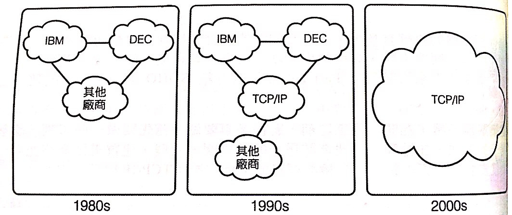

- TCP/IP未紅以前，購買不同廠商的電腦，就要建置不同的網路模型
- 後來**ISO**制定了**OSI**模型
- **DoD**也制定了**TCP/IP**模型，而且贏了

<!--endsec-->

<!--sec data-title="概觀" data-id="2" data-nopdf="true" data-collapse=false ces-->

- TCP/IP 採用RFC文件製作
- 左邊是舊版，右邊是新版

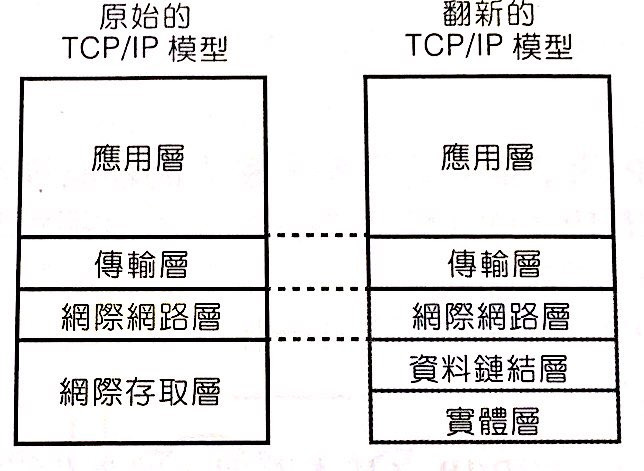

<!--endsec-->

<!--sec data-title="TCP/IP應用層" data-id="3" data-nopdf="true" data-collapse=false ces-->

- 定義應用程式所需的服務，如**HTTP**

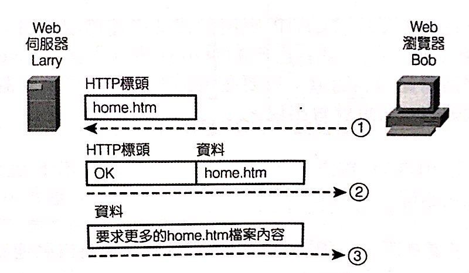

<!--endsec-->

<!--sec data-title="TCP/IP傳輸層" data-id="4" data-nopdf="true" data-collapse=false ces-->

- 代表作有**TCP**與**UDP**
- 目的是為上層提供服務
- 如TCP的錯誤修復

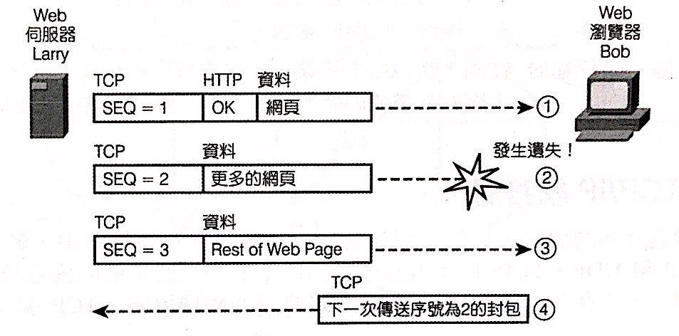

>透過增加SEQ碼來確認是否Lost封包

- **相鄰層互動**指的是同一台電腦的上下層互動
- **同層互動**指的是不同電腦，透過網路相同階層上的互動

<!--endsec-->

<!--sec data-title="TCP/IP網路層" data-id="5" data-nopdf="true" data-collapse=false ces-->

- 負責**IP定址**&**路由**這類的工作
- 類似**郵政服務**

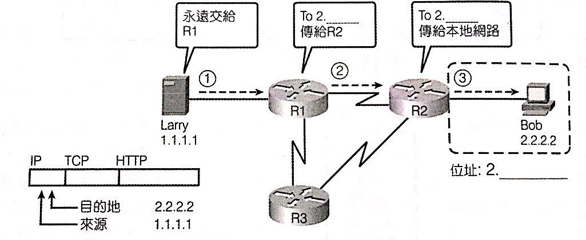

<!--endsec-->

<!--sec data-title="TCP/IP鏈結層" data-id="6" data-nopdf="true" data-collapse=false ces-->

- 根據特定媒介的協定，替封包加上**LAN**或**WAN**的**標頭**跟**標尾**

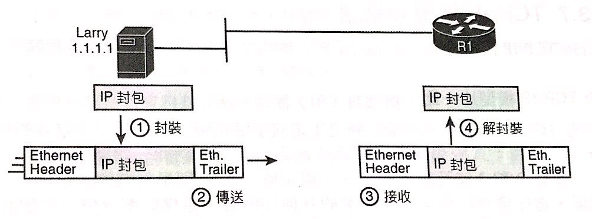

<!--endsec-->

<!--sec data-title="TCP/IP實體層" data-id="7" data-nopdf="true" data-collapse=false ces-->

- 指**接頭** 、**腳位**、電流量、編碼、光調變等

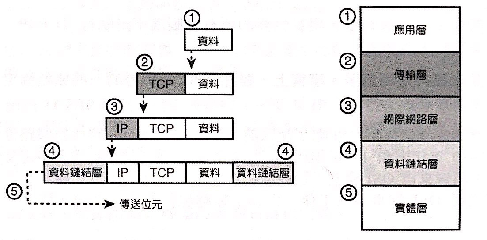

<!--endsec-->

<!--sec data-title="TCP/IP模型" data-id="8" data-nopdf="true" data-collapse=false ces-->

- **封裝**是指**鏈結層**
- **資料段(segment)**、**封包(packet )**、**訊框(frame)**

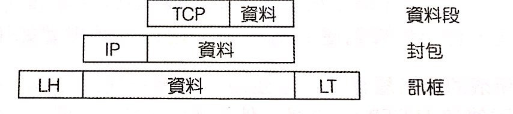

>封包是添加東西最多、最肥的一層

<!--endsec-->

<!--sec data-title="OSI網路模型" data-id="9" data-nopdf="true" data-collapse=false ces-->

- **應用層**: 通訊軟體介面，如HTTP
- **表現層**: 加密與資料格式，如ASCII & JPEG
- **會談層**: 控制與結束對話
- **網際網路層**vs**網路層**

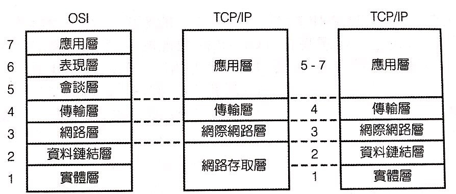

- 口訣All People Seem To Need Data Processing. (字首對應7-1層)
- 分層優點有**不複雜**、**標準介面**、**易於學習**、**易於發展**、**廠商互通**、**工程模組化**

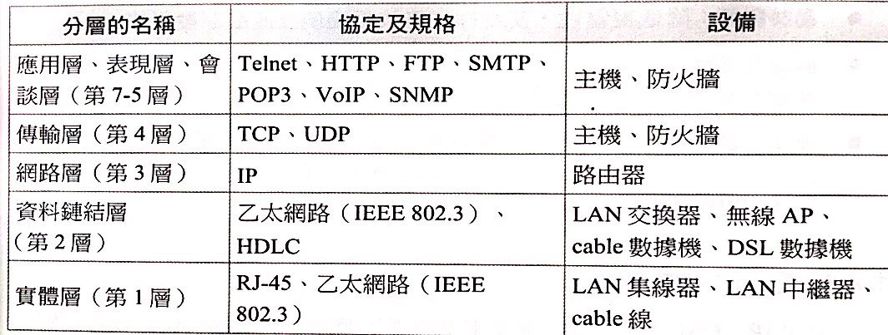

- OSI的封裝術語為**協定資料單元(PDU)**

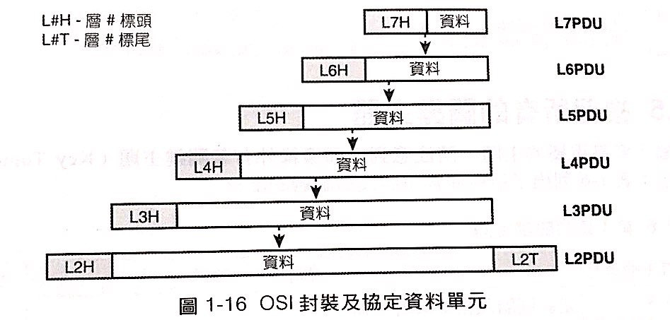

<!--endsec-->