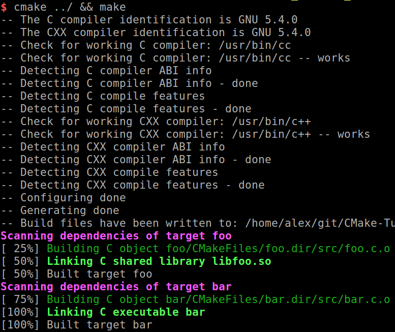
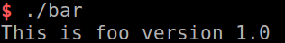

# Target

[TOC]

## Target properties

### INTERFACE_INCLUDE_DIRECTORIES

若此Target為`Library`，則此Property代表`public include directories`的List

- `Target B`若link到此`Target A`，則
  `Target B`會自動include`Target A`Property中`INTERFACE_INCLUDE_DIRECTORIES`所指向的directories，
  因此不必再特別設定`include_directories`

- 可以透過`set_target_properties`設定

``` CMake
set_target_properties(${TargetName}
  PROPERTIES
  INTERFACE_INCLUDE_DIRECTORIES   ${PROJECT_SOURCE_DIR}/inc
)
```

- 若`target_include_directories()`指令中，值被設定為`PUBLIC`或是`INTERFACE`，則
  `target_include_directories()`內的設定值會自動加入`INTERFACE_INCLUDE_DIRECTORIES`

## target_include_directories

### 說明

``` CMake
target_include_directories(<target> [SYSTEM] [BEFORE]
  <INTERFACE|PUBLIC|PRIVATE> [items1...]
  [<INTERFACE|PUBLIC|PRIVATE> [items2...] ...])
```

- 為Target添加`include directories`
- `PUBLIC`, `PRIVATE` and `INTERFACE`此3個為Keyword

>
>PUBLIC:
會將`target_include_directories()`的值發佈到`INCLUDE_DIRECTORIES`與`INTERFACE_INCLUDE_DIRECTORIES`

>PRIVATE:
會將`target_include_directories()`的值發佈到`INCLUDE_DIRECTORIES`

>INTERFACE:
會將`target_include_directories()`的值發佈到`INTERFACE_INCLUDE_DIRECTORIES`

### Directory

```bash
CMakeLists.txt
foo
-CMakeLists.txt
-src
--foo.c
-inc
--foo.h
bar
-CMakeLists.txt
-src
--bar.c
```

### Root

CMakeLists.txt

```cmake
cmake_minimum_required(VERSION 2.8)
add_subdirectory(foo)
add_subdirectory(bar)
```

### Foo

`foo/CMakeLists.txt`

```cmake
cmake_minimum_required(VERSION 2.8)
project(Foo)

add_library(foo SHARED src/foo.c)

target_include_directories(foo PUBLIC
  ${PROJECT_SOURCE_DIR}/inc
)

# target_include_directories(foo PRIVATE

# ${PROJECT_SOURCE_DIR}/inc

# )

# set_target_properties(foo

# PROPERTIES

# INTERFACE_INCLUDE_DIRECTORIES   ${PROJECT_SOURCE_DIR}/inc

# )

```

`foo/src/foo.c`

```c
# include "foo/foo.h"

# include <stdio.h>

void foo(void)
{
 printf("This is foo version %s\n", "1.0");
}
```

`foo/inc/foo.h`

``` c
# pragma once
# ifndef FOOBAR_FOO_H
# define FOOBAR_FOO_H

void foo(void);

# endif
```

>若將`target_include_directories(PUBLIC)`
改為以下：

``` CMake
target_include_directories(foo PRIVATE
  ${PROJECT_SOURCE_DIR}/inc
)
```

>會造成build `bar.c`失敗 =>
`bar/src/bar.c:2:21: fatalerror: foo/foo.h: 沒有此一檔案或目錄`
∵沒有設定`INTERFACE_INCLUDE_DIRECTORIES`
∴`Target bar`找不到`Target foo`需要的include directories

>若改為以下：

``` CMake
set_target_properties(foo
  PROPERTIES
  INTERFACE_INCLUDE_DIRECTORIES   ${PROJECT_SOURCE_DIR}/inc
)
```

> 會造成build `foo.c`失敗 =>
`foo/src/foo.c:2:21: fatal error: foo/foo.h: 沒有此一檔案或目錄`
∵沒有設定`INCLUDE_DIRECTORIES`
∴`Target foo`找不到需要的include directories

> 在這個範例看不出使用`set_target_properties`來設置`INTERFACE_INCLUDE_DIRECTORIES`的好處，
> 那麼什麼時候會需要用到呢？
> 等我們講到`Importing Targets`的時候，`set_target_properties`就非用不可了。

> `Importing Targets`：
將`外部`已經build好的library(`.a` or `.so`)或是executable file(`.exe`)，
引入到當前CMake的Project中，使其成為一個`邏輯上的Target`。
由於這類的Target無法使用`target_include_directories()`，
此時便需要`set_target_properties`來設置`INTERFACE_INCLUDE_DIRECTORIES`

``` CMake
add_library( External_lib SHARED IMPORTED GLOBAL )

set_target_properties( External_lib
    PROPERTIES
    IMPORTED_LOCATION /path/to/libExternal_lib.so
    INTERFACE_INCLUDE_DIRECTORIES /path/to/External_lib/include
)
```

### Bar

`bar/CMakeLists.txt`

``` cmake
cmake_minimum_required(VERSION 2.8)
project(Bar)

add_executable(bar src/bar.c)
target_link_libraries(bar
  foo
)
```

`bar/src/bar.c`

```c
# include "foo/foo.h"

int main(int argc, char* argv[])
{
 foo();
 return 0;
}
```

### Result




