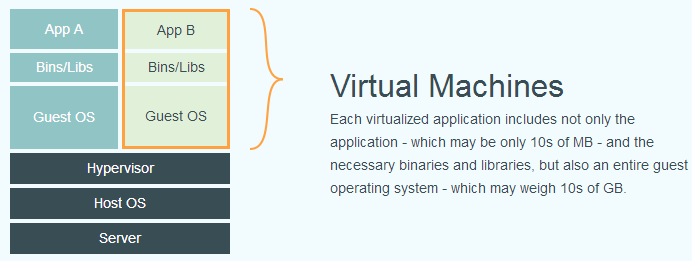
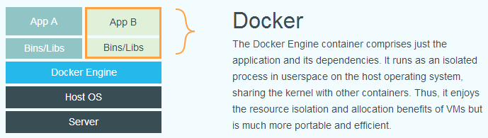

# Basic

[TOC]

## Introduction

sudo docker run -it --privileged -v /dev/bus/usb:/dev/bus/usb ubuntu:14.04 /bin/bash
sudo docker exec -u root -it compassionate_snyder bash

'su' command in Docker returns 'must be run from terminal'

When you are ssh-ing in or going in via php your session is not being allocated a pty. I have used each of the following solutions:

ANSWER 3: use python to spawn a pty in your shell

Quite a cute hack :)

jenkins@e9fbe94d4c89:~$ su -
su: must be run from a terminal

$ echo "import pty; pty.spawn('/bin/bash')" > /tmp/asdf.py
$ python /tmp/asdf.py

$ su -
Password:

root@e9fbe94d4c89:~#

### 什麼是 Docker

- Docker 是一個開源專案，誕生於 2013 年初，最初是 dotCloud 公司內部的一個業餘專案。它基於 Google 公司推出的 Go 語言實作。 專案後來加入了 Linux 基金會，遵從了 Apache 2.0 協議，原始碼在 GitHub 上進行維護。

- Docker 自開源後受到廣泛的關注和討論，以至於 dotCloud 公司後來都改名為 Docker Inc。Redhat 已經在其 RHEL6.5 中集中支援 Docker；Google 也在其 PaaS 產品中廣泛應用。

- Docker 專案的目標是實作輕量級的作業系統虛擬化解決方案。 Docker 的基礎是 Linux 容器（LXC）等技術。

- 在 LXC 的基礎上 Docker 進行了進一步的封裝，讓使用者不需要去關心容器的管理，使得操作更為簡便。使用者操作 Docker 的容器就像操作一個快速輕量級的虛擬機一樣簡單。

下面的圖片比較了 Docker 和傳統虛擬化方式的不同之處，可見容器是在作業系統層面上實作虛擬化，直接使用本地主機的作業系統，而傳統方式則是在硬體層面實作。





## How To Install and Use Docker on Ubuntu 16.04

``` bash
sudo apt-get update
sudo apt-key adv --keyserver hkp://p80.pool.sks-keyservers.net:80 --recv-keys 58118E89F3A912897C070ADBF76221572C52609D
echo "deb https://apt.dockerproject.org/repo ubuntu-xenial main" | sudo tee /etc/apt/sources.list.d/docker.list
sudo apt-get update
apt-cache policy docker-engine
```

>docker-engine:
  Installed: (none)
  Candidate: 1.11.1-0~xenial
  Version table:
     1.11.1-0~xenial 500
        500 <https://apt.dockerproject.org/repo> ubuntu-xenial/main amd64 Packages
     1.11.0-0~xenial 500
        500 <https://apt.dockerproject.org/repo> ubuntu-xenial/main amd64 Packages

``` bash
sudo apt-get install -y docker-engine
sudo systemctl status docker
```

>● docker.service - Docker Application Container Engine
   Loaded: loaded (/lib/systemd/system/docker.service; enabled; vendor preset: enabled)
   Active: active (running) since Sun 2016-05-01 06:53:52 CDT; 1 weeks 3 days ago
     Docs: <https://docs.docker.com>
 Main PID: 749 (docker)

## Install ubuntu

``` bash
oem@Alex:~$ sudo docker pull ubuntu
[sudo] password for oem: 
Using default tag: latest
latest: Pulling from library/ubuntu

f069f1d21059: Pull complete 
ecbeec5633cf: Pull complete 
ea6f18256d63: Pull complete 
54bde7b02897: Pull complete 
Digest: sha256:bbfd93a02a8487edb60f20316ebc966ddc7aa123c2e609185450b96971020097
Status: Downloaded newer image for ubuntu:latest
```

## 列出本機映像檔

``` bash
$ sudo docker images
REPOSITORY       TAG      IMAGE ID      CREATED      VIRTUAL SIZE
ubuntu           12.04    74fe38d11401  4 weeks ago  209.6 MB
ubuntu           precise  74fe38d11401  4 weeks ago  209.6 MB
ubuntu           14.04    99ec81b80c55  4 weeks ago  266 MB
ubuntu           latest   99ec81b80c55  4 weeks ago  266 MB
ubuntu           trusty   99ec81b80c55  4 weeks ago  266 MB
```

創造容器

``` bash
sudo docker run -ti utuntu:14.04 bash
```

啟動容器

``` bash
sudo docker start nostalgic_hypatia
```

進入容器

``` bash
sudo docker exec -ti nostalgic_hypatia bash
sudo docker attach nostalgic_hypatia
```

查看容器

``` bash
oem@Alex:~$ sudo docker ps -a
CONTAINER ID        IMAGE               COMMAND             CREATED              STATUS                          PORTS               NAMES
8dd510fc3be5        ubuntu:14.04        "/bin/bash"         About a minute ago   Exited (0) About a minute ago                       happy_fermat
091a9c73d24e        ubuntu:14.04        "/bin/bash"         57 minutes ago       Up 57 minutes                                       gigantic_knuth
```

刪除容器

``` bash
oem@Alex:~$ sudo docker rm happy_fermat
happy_fermat
```

cp到容器內

``` bash
sudo docker cp gstreamer_example/ gigantic_knuth:/
```

rename容器

``` bash
sudo docker rename OLD_NAME NEW_NAME
```

scratch -> debian -> busybox

如何進到docker container file system:

1. start container
2. get root

``` bash
if [ -z "$1" ] ; then
 echo 'docker-find-root $container_id_or_name '
 exit 1
fi
CID=$(docker inspect   --format {{.Id}} $1)
if [ -n "$CID" ] ; then
    if [ -f  /var/lib/docker/image/aufs/layerdb/mounts/$CID/mount-id ] ; then
        F1=$(cat /var/lib/docker/image/aufs/layerdb/mounts/$CID/mount-id)
       d1=/var/lib/docker/aufs/mnt/$F1
    fi
    if [ ! -d "$d1" ] ; then
        d1=/var/lib/docker/aufs/diff/$CID
    fi
    echo $d1
```

3. cd `root path`
