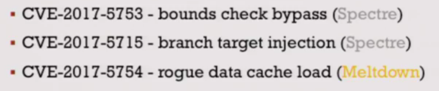

# Meltdown & Spectre Attack

[TOC]

## 0. CPU Architecture

- Front-end
  - `Fetch` and `Decode`：擷取並分析該做什麼指令
- Execution Engine
  - Recorder Buffer
  - `Execution Unit`：有很多個執行單元並行執行，用來提升效率
        

## 1. Meltdown

- 利用CPU的Out of order
  - CPU不一定按順序執行，會偷跑後面的程式碼(`Execution Unit`並行執行)

        

        > 若發現偷跑的指令不合法則把指令結果丟棄，但指令有可能造成被保護的memory address value搬到cache前面指令出錯的話，他會丟棄偷跑的code而不commit這筆執行但即便被丟棄，也執行過了，有可能在cache留下資料比如從memory拿一些資料到cache，但CPU 並不知道cache的這些資料是偷跑的程式拿到的cache內就會留下許多你的程式不應該Touch到的memory資料
        >
- 利用CPU的Speculative Execution
  - CPU如果執行If else判斷，連續好幾次都是True的話，他會猜下一次也是True,所以偷跑True判斷式內的程式

        > 一樣有可能偷跑的會丟棄，但已經把 value 寫到 cache 內了
        >

### 1-1 使用Micro architectural side-channel attacks

- 如何尋找某一筆資料被搬到cache內，可以根據讀取時間來推測
- FLUSH + RELOAD Attack
  - 建構一個array[256]，如果此array中有某一個值最近被讀取過(進cache)，則下次讀取時，時間必定較快
  - 所以只要利用時間差，就可以知道某一個Address的值是在cache內
  - 利用偷跑指令+觀察cache法，可以讀出任何你想要的memory data
  

### 1-2 Example

- 先放資料
- 放偷跑指令(Transient instruction)

- 得到先前資料

    > 注意code不要被compiler optimise
    >

- 抓出memory and cache 的時間差

## 2. Spectre

- Previous train 來誤導CPU if else的預測

    

## 3. IC

## 4. Impact

- `Meltdown`: Most Intel Processors
- `Spectre`: Intel, AMD, ARM processors
