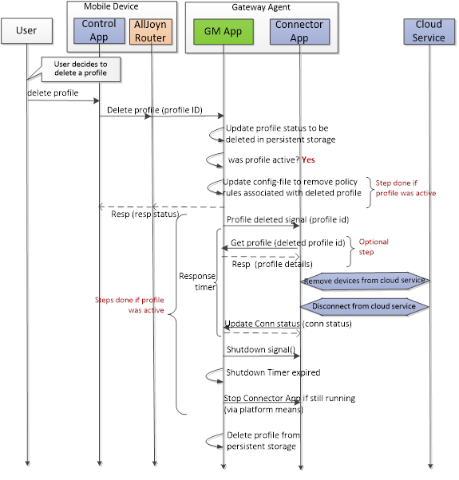
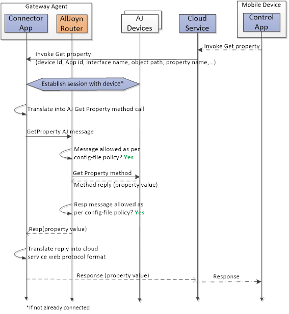

# 架構說明

tags: Alljoyn,Framework,Gateway

## 名詞定義

|   縮寫     |    描述 |
| :-------- | --------:|
| GM App  | Gateway Management app |
| WKN  | **Well-Know Name**，有別於About的建立session方式 |
| ACL  | Access Control List |
| Config file  | 描述Alljoyn router的Policy(Allow or Deny) |
| SLS  | Sessionless Signal |

<!--sec data-title="什麼是Alljoyn Gateway?" data-id="1" data-nopdf="true" data-collapse=false ces-->

- 基於Alljoyn Framework所開發的一套**Framework**
- 主旨是快速開發一套：**管理裝置行為**、**設定操作權限**、**雲端控制**的一系列功能
- 講白一點，就是有一份XML，記錄著每個`Alljoyn service`內的**成員們**是否公開，或者是只允許被某個`Alljoyn Client`控制

- 接下來的內容，會將這份XML稱為`ACL(Access Control List)`

- ACL實際上是去更新Alljoyn router的防火決策，而Alljoyn router把決策記錄在一份`Configure file`



- 將Alljoyn router視為一道防火牆，有一份通行決策(`Configure file`)

- ACL可以有很多份，但只有一份會`生效(Activity)`



- 在這Framework下，產生了三個負責不同職責的角色
  - `Gateway Management app`
  - `Connector app`
  - `Control app`

<!--endsec-->

<!--sec data-title="介紹一下角色的職責吧" data-id="2" data-nopdf="true" data-collapse=false ces-->

- 在介紹職責之前，我必須要先講解我們想要的**目標**、**架構**與**流程**
- 我們希望可以透過網路來**控制Device**，無論**區網**或**外網**
  - 區網：`Control App`透過Alljoyn機制直接控制Device
  - 外網：`Control App`登入Cloud，並呼叫有註冊且在線的`Connector`來控制Device

- 因此，我們需要有`Control App`,`Connector App`
- 再來，我想指定`Alljoyn service`的一部分成員公開，或只允許被某些`Alljoyn Client`控制
- 所以我要建立一份ACL，來更新`Configure file`
> 或是建立多份ACL，但只有一個生效
- 建立並修改ACL的工作，將交由使用者登入`Control App`後進行操作
> 基於安全因素，ACL只被允許在區網內透過`Control App`修改
- 而維護ACL，並更新`Configure file`的工作，交給`GM app`處理

- `GM App`為了將當前配置上傳至Cloud，需要與`Connector`建立`Non Session`連線(透過WKN機制)
- 一個`Connector`對應一個Cloud，也對應一份目前正在運行的ACL

> 基於安全因素，`Connector`與`GM App`是使用不同Linux User分別執行

### GM App的職責是？

- **管理ACL**：透過About機制，使能被`Control App`搜尋並建立Session
- **更新Config File**：根據ACL的啟動/關閉，來更新Config File
> Config File的機制為透過(Allow / Deny) Linux (User / Group) 來建立Alljoyn router Policy
- 提供**列出ACL**的Method給`Connector`呼叫
- 透過WKN與**Connector建立Non Session連線**



- WKN是規格寫死的名稱：
  - GM app WKN：`org.alljoyn.GWAgent.GMApp`
  - Connector app WKN：`org.alljoyn.GWAgent.Connector.<Connector Id>`



### Connector的職責是？

- 與**Cloud**建立連線並傳輸/接收資料
- 在**Config File**允許的情況下，與**Device互動**
- 位於Cloud與Alljoyn Device的之間，將Alljoyn資料與Cloud資料做**Protocol的轉換**
- 透過GM App所發出的Signal來了解ACL是否已經被**更新/刪除**
- 透過GM App取得**正在啟用的ACL**

### Control App的職責是？

> 以下所敘述的功能不一定全部包含，由服務提供商自行定義，有可能只包含一部分的功能

- 擁有**建立**/**刪除**/**啟動**/**關閉**/**更新**ACL的功能與**UI介面**
- 與服務提供商的Cloud建立**User login**的機制
- **控制Device**行為

### Alljoyn Router的職責是？

- 正確執行**Config File**所記載的`Policy`

<!--endsec-->

<!--sec data-title="Control App有什麼Secure機制嗎？" data-id="3" data-nopdf="true" data-collapse=false ces-->

- 由於`GM App`提供操作ACL的Interface必須是嚴格控管的，`Control App`要使用此Interface的Method前，必須輸入**Password**/**PIN**
- `GM App`應該內建Default的`Password`/`PIN`，並於`Control App`登入後，交由User自行修改

<!--endsec-->

<!--sec data-title="Gateway的各項流程圖" data-id="4" data-nopdf="true" data-collapse=false ces-->

### Gateway Discover

### 管理ACL

#### Create ACL

#### Activate ACL

#### Connector startup

#### Update ACL

#### Delete ACL

#### Disable ACL

### Notification

#### 送出 Notification

#### 接收 Notification

### 控制AllJoyn Device

#### 呼叫Method

#### Get property

#### Set property

#### Remoting session-based signal

<!--endsec-->

<!--sec data-title="與ACL相關的成員" data-id="5" data-nopdf="true" data-collapse=false ces-->

### GM app管理ACL的部分

#### Method

- `Create profile`
- `Activate profile`
- `Get profile`
- `GetProfileStatus`
- `GetProfileList`
- `Update profile`
- `Delete profile`
- `Deactivate profile`

### Connector提供給外網的部分

#### Method

- `Get profile`
- `Update connection status`

#### Signal

- `Profile updated`
- `Profile deleted`
- `Shutdown App`

<!--endsec-->

<!--sec data-title="Config File" data-id="6" data-nopdf="true" data-collapse=false ces-->

- Config File內的Policy應該要使GM App能收到所有設備的`About`(Default)
- GM App啟動時，應該基於已經安裝的Connector ID，建立`Deny-all`的Policy
- GM App應該根據ACL**修改Config File**內的Policy
- 當Active的ACL被**Disable**或是**Delete**時，GM App要**移除與此ACL相關的Policy**
- Policy可以**Allow**/**Deny** `Connector`發出**Notification**
- Policy可以**Allow**/**Deny** `Connector`接收某**Device的Notification**
- Policy可以**Allow**/**Deny** `Connector`對發出**Signal**
- Policy可以**Allow**/**Deny** `Connector`接收某**Device的Signal**
- Policy可以**Allow**/**Deny** `Connector`呼叫某**Device的Method**
- **Config File**的Policy會隨著**Runtime**而不斷改變
- **Config File**的Reload有兩種方法，一種是取得Bus的`ProxyBusObject`並引用其Interface的Method；另一種是發送平台訊號(如`Kill xxx`)來觸發
> `GM App`採用前者的方式

<!--endsec-->

<!--sec data-title="Connetor與Cloud的架構與設計" data-id="7" data-nopdf="true" data-collapse=false ces-->

### 架構

- 服務提供商在Cloud端建立`App Download Server`，管理所有可供下載的**Connector Package**
- Control App於User login Cloud後，提供UI介面，便於User從`App Download Server`下載**Connector Package**，且提**Install**/**Upgrade**等UI介面。
> 基於上面的需求，`GM App`必須提供一個Interface給`Control App`，以便管理**Connector Package**的**Install**/**Upgrade**/**Uninstall**/**Restart**
- 基於安全考量，應由`Package Manager(PM)`管理需要安裝的**Connector Package**並驗證數位簽章是否符合
> `PM`與`GM App`互動的實作與細節不在此討論內。

- **Install**或其他Method被呼叫時，實際上`Control App`將URL傳給`GM App`，並交由PM下載、驗證、安裝並分配一個唯一**Linux User**給此**Connector Package**當作識別



- 每一個被安裝的**Connector Package**都有被分配到一個**唯一的Linux User**
- **Connector Package**被分配到的**Linux User**都屬於**同一個Group**



- `GM App`應該將已經安裝的**Connector Package**紀錄成一個表格，包含
  - Connector Id
  - App Name
  - App Package Name
  - App version
  - App package File URL
  - App User Id
  - App Group Id
  - Install Status
  - Install Description
  - Connection Status
  - Operational Status
- 所有**Connector Package**內，在預定位置必須含有**manifest file**，來描述此`Connector`提供的Service，以及預期能與之互動的Interface

### 設計細節

#### App Management interface

##### Method

- `Install App`
- `Uninstall App`
- `Restart App`
- `Get App Status`
- `Get Installed Apps`
- `Get Manifest Data`
- `Get Manifest Interfaces`

##### Signal

- `App Status Changed`

#### Package Manager app functions

##### Method

- `Install App`
- `Uninstall App`

### Manifest file

- `Install App`
- `App Package Name`
- `App version`
- `Min AJ SDK version`
- `exposed Services`
- `List <Desired AllJoyn Interfaces for access>`
- `execution Info`

<!--endsec-->

> 外部連結：
> [Alljoyn Gateway wiki](https://wiki.allseenalliance.org/gateway/gatewayagent)