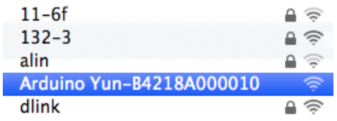
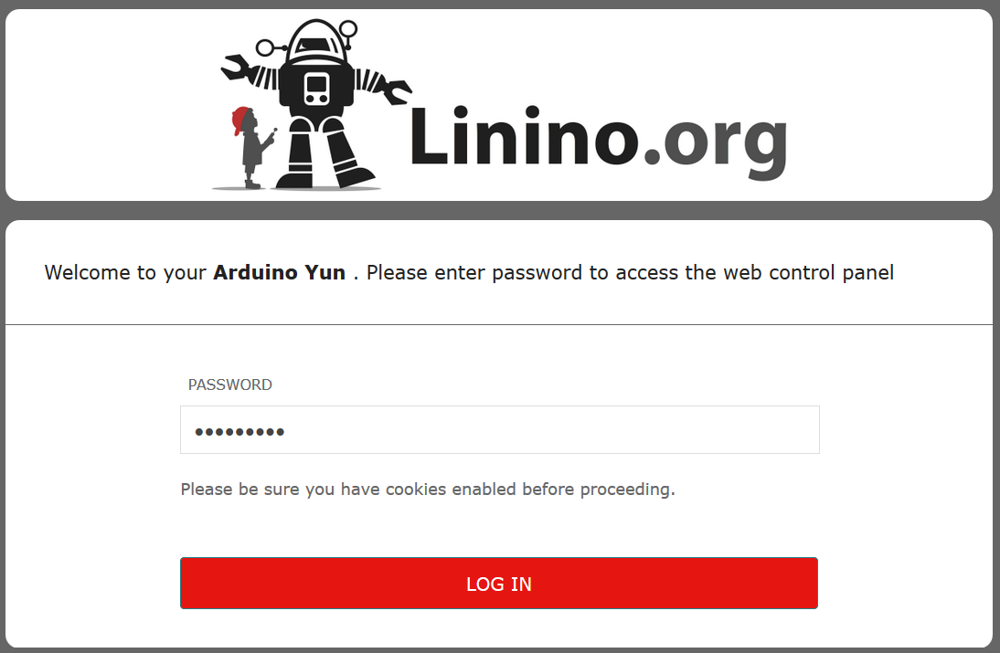

# 基本建置

tags: Arduino,Hardware,Yún

## 名詞定義

|   縮寫     |    描述 |
| :-------- | --------:|
| Yún  | Arduino系列中唯一有中文名稱的型號–**雲** |

<!--sec data-title="硬體規格" data-id="1" data-nopdf="true" data-collapse=false ces-->

- 微控制器**ATmega32U4** : x1
- SOC**Atheros AR9331** : x1
  - 運行Linux發行套件**Linino**
  > **Linino**是以**OpenWRT**為基礎修改而成的OS

- Ethernet
- WiFi
- USB A埠
- micro SD卡


<!--endsec-->

<!--sec data-title="上電" data-id="2" data-nopdf="true" data-collapse=false ces-->

- Yún接上電源後，此時WiFi處於**AP模式**，所以可從電腦連接，其分享出來的SSID會類似`Arduino Yun-XXXXXXXXXXXX`



- 瀏覽器輸入網址 http://arduino.local 或`192.168.240.1`，便可看到如下畫面，要求輸入密碼，預設密碼是「`arduino`」


- 點按「**CONFIGURE**」進行組態設定


- 設定Wifi


- 按下**CONFIGURE & RESTART**


<!--endsec-->

<!--sec data-title="從Arduino IDE燒入" data-id="3" data-nopdf="true" data-collapse=false ces-->

打開Arduino IDE，從選單「**工具-序列埠（Tools-Port）**」看到含有IP位址的Yún，勾選後，記得從選單「**工具-板子**」勾選**Yún**


wifi燒入需要密碼


<!--endsec-->

<!--sec data-title="Update image" data-id="4" data-nopdf="true" data-collapse=false ces-->

將Image(bin檔)放入micro SD卡，插入Arduino並確認Mount完成後，執行以下指令。

``` bash
run-sysupgrade /mnt/sda1/openwrt-ar71xx-generic-linino-yun-16M-250k-squashfs-sysupgrade.bin
```

新版介面的密碼「`doghunter`」



<!--endsec-->

<!--sec data-title="安裝SFTP" data-id="5" data-nopdf="true" data-collapse=false ces-->

``` bash
opkg update
opkg install openssh-sftp-server
```

<!--endsec-->