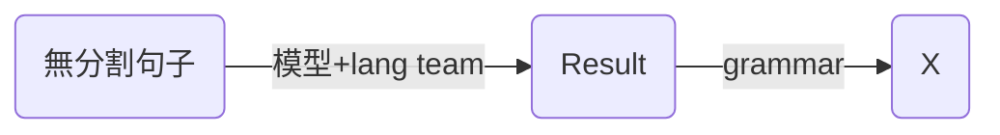
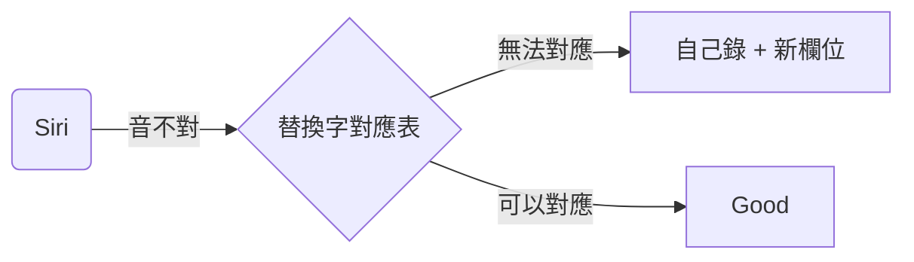

# 1 分詞

## 1-1 單詞切割

## 1-2 單詞發音： 1234聲

- TTS (X 不考慮online)
> ML -> 句子 -> 切割

## 1-3 單詞發音： 破音字

- TTS (X 不考慮online)
> ML -> 句子 -> 切割

# 2 字典 (open source)
- Word Definition <-> 1-1 單詞切割
- Online or Offline

# 3 API調整
