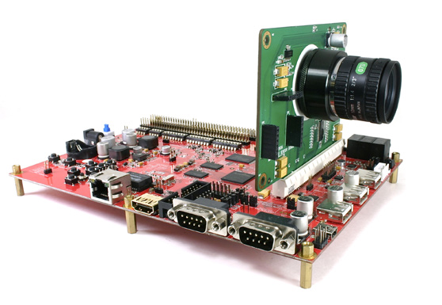
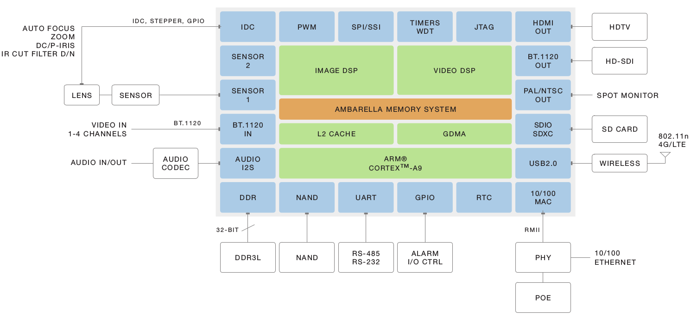
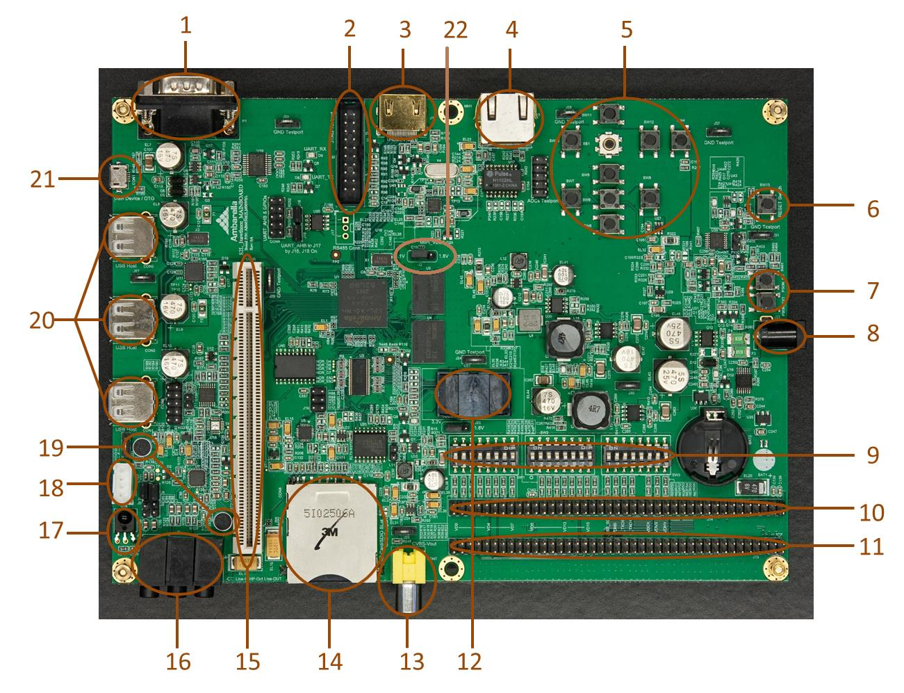
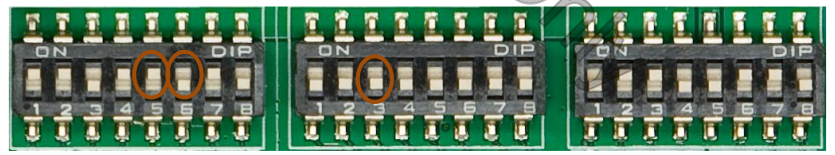
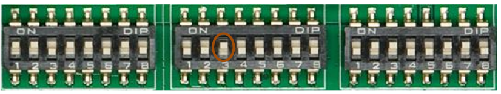
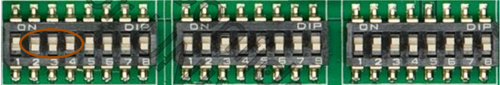
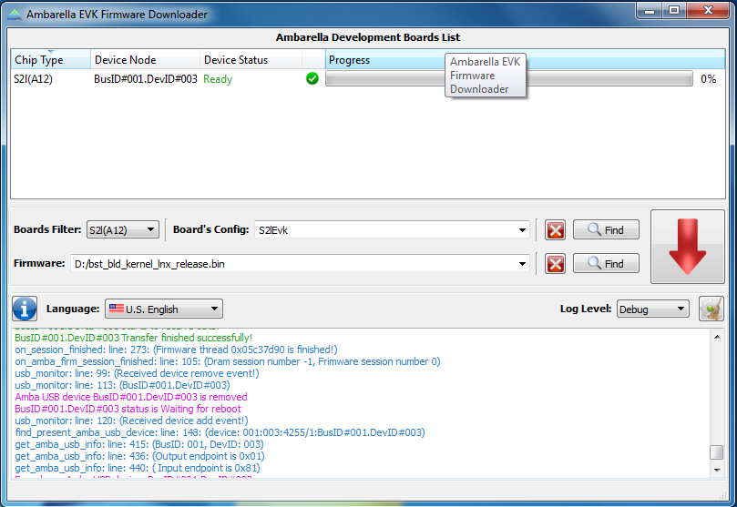

<!-- slide -->
# Ambarella S2L - Overview

<!-- slide -->
# S2L SOC Overview

- IP Camera Processor
- ARM® `CortexTM-A9` CPU
- Clock speeds up to `800 MHz`

<!-- slide -->
# Design

<!-- slide -->
# Camera module

- `24-bit` RGB Bayer
- `14 M`pixel resolution
- Image sensor pipeline (ISP)
- H.264 encoder
- HDR
- 3DNR
- WDR
- Adjustable AE/AWB/AF
- 180° fish-eye

<!-- slide -->
# Evaluation Kit (EVK)
- S2L main board
- Sensor board
- `Serial` cable & `USB` cable
- Datasheet
- BOM
- Layout
- IP Camera reference application with C source code
- Firmware
- Getting Started Document
- Unit Test Programs
- Install Program
> AmbaUSB - Windows and Linux version to program the NAND flash
> Port Server - windows tool to record video from platform to PC by network
> USB Server
> VLC player

<!-- slide -->

<!-- slide -->
1. UART
2. JTAG
3. HDMI VOUT
4. Ethernet
5. Control buttons
6. Reset
7. Power on/off
8. 12V DC power
9. DIP switches
10. Digital VOUT (24-bit RGB888 LCD)
11. Digital VOUT (8-bit/16-bit LCD)

<!-- slide -->
12. NAND socket
13. CVBS VOUT
14. SD/SDXC card (One at the top, one at the bottom which supports eMMC card boot direct)
15. Primary VIN
16. Audio Line-in/Line-Out/HP-Out
17. IR-receiver
18. DC-Iris connector
19. Stereo MIC
20. USB Host
21. USB device ( or Host with OTG cable )
22. J2

<!-- slide -->

<!-- slide -->
# Kernel
- Linux `3.10.50+` SDK
- Ubuntu `14.04` LTS Linux Desktop `i386` (recommended)
- Ambarella enhancement (patch) files
- Boot from `SPI-NOR`, `SPI-EEPROM`, `NAND flash`, `USB` or `eMMC`

<!-- slide -->
# Toolchain
- Linaro `GCC 4.9`
- Linaro `EGLIBC 2.18`
- Linaro `GDB 7.6.1`
- Linaro `Binutils 2.23.2`

<!-- slide -->
# Drivers
- IAV Driver (CODEC functions)
- DSP, VIN, VOUT, Image Processing Drivers

<!-- slide -->
# Librarys
- Image Processing (AE/AWB/Motion Detection) library
> libimg_algo_s2l.a
> libimg_dsp_s2l_hf.a
- Middleware library for image processing (wrapper library)
> libamp.so
- Low bit rate library - `liblbr.so`
- Text insertion library - `libtextinsert.a`
- Motion detection library - `libmd_motbuf.a`
- ALSA - `libasound.a`

<!-- slide -->
# Demo and test application
- Encoding and streaming - `test_encode` , `test_stream` , `test_bsreader`
- Load DSP microcode - `load_ucode`
- Capture / parse DSP log - `dsplog_cap`
- Exercise OSD insert functionality - `test_overlay` , `test_textinsert`
- Exercise Digital Pan / Tilt / Zoom - `test_dptz`
- Capture RAW/YUV/ME1 data - `test_yuvcap`
- Exercise Privacy mask - `test_privacymask`
- Run 3A process - `test_image`, `test_tuning`
- Application to run RTSP streaming - `rtsp_server`

<!-- slide -->
# Set Up the Hardware
- Connect the `sensor board` to the `primary VIN slot 15`
- `Ethernet port` - `EVK board` to `host`
- `SD` video preview - `CVBS`
- `HD` preview - `HDMI`
- `UART console` window - `UART1 port` to a `COM port` by `RS232`

<!-- slide -->
# Set Up the Hardware - Boot
- Boot from `NAND`

- Boot from `USB`

- Connect power jack

<!-- slide -->
## Set Up the Hardware - Clock

- `1GHz`

- `800MHz`

- `600MHz`

> Check: `$cat /proc/ambarella/clock`

<!-- slide -->
# Set Up Host

- AmbaUSB - USB update Firmware (Windows & Linux)
- Port Server - 用TCP接收串流
- USB Server - 用USB接收串流
- ffdshow - 影音解碼
- VLC- 影音RTSP串流
- PuTTY

<!-- slide -->
# VLC - Play H.264

- `Tools > Preferences`

<!-- slide -->
# IP
- Host - `10.0.0.1`
- EVK board - `10.0.0.2`

<!-- slide -->
# PuTTY / Minicom
### Serial
- Speed - `115200` (bits per second)
- Data Bits - 8
- Parity - None
- Stop Bits - 1
- Flow Control - None

### Telnet
- Host Name (or IP address) - `10.0.0.2` (default)
- Port - `23`

### Login
- root

<!-- slide -->
# Upgrade Firmware - USB Download Mode
1. 接USB線
2. 開關切到`NAND Boot Mode`
3. 進Serial Console
4. 壓住`Enter` Key
5. 按一下板子的`RESET` button
6. 進入AMBoot shell後輸入`usbdl` or `u`
> $amboot> usbdl
Start transferring using USB...
init_usb_dev done
init_usb_hardware done
entering usb_task

<!-- slide -->
# Upgrade Firmware - USB Download Mode

<!-- slide -->
# Upgrade Firmware - AmbaUSB (Ubuntu)
1. 進`USB Download Mode`
2. 開啟 `AmbaUSB`
3. Boards Filter - `S2L`
4. Board’s Config - `S2lEvk`
5. `Find`
6. `Program Terminate`
7. wait for auto reboot...
8. switches to `NAND Boot Mode` and reboot

<!-- slide -->

<!-- slide -->
# Upgrade Firmware - AmbaUSB (Windows)
1. Install `Tools/AmbaUSB`
2. Same as Linux

<!-- slide -->

<!-- slide -->
Ticks (an easy to use tick counter to measure delay)
IP Config Tool (supports zeroconf/Bonjour, camera IP config and view)
